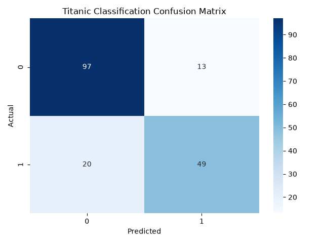
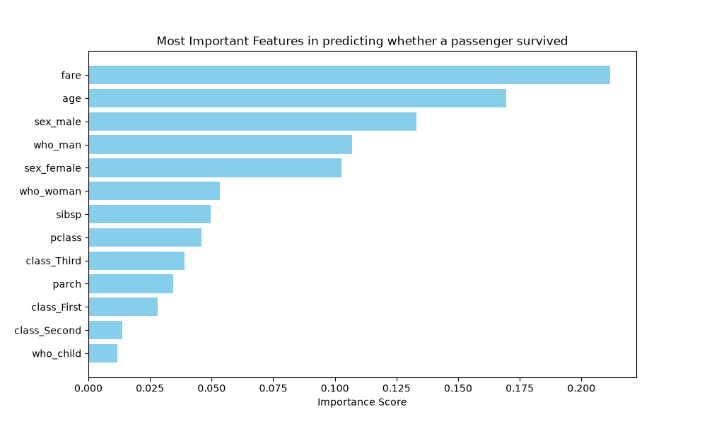
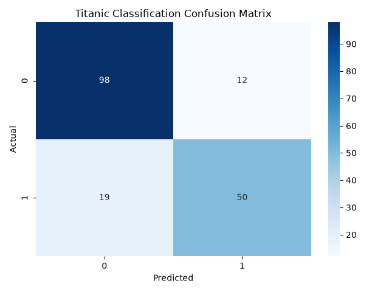
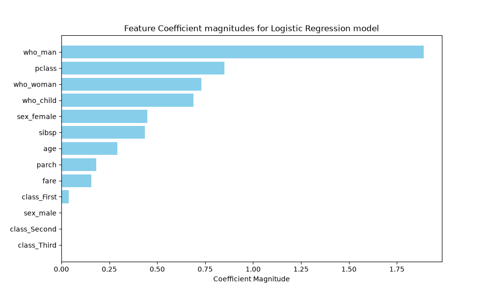

# Titanic Survival Prediction

A machine learning classification project that predicts whether a passenger survived the Titanic disaster using demographic and travel-related information.

The project compares **Random Forest** and **Logistic Regression**, using preprocessing pipelines, cross-validation, and hyperparameter tuning.

---

## Project Overview

This project demonstrates an end-to-end machine learning classification workflow:

* Data exploration
* Train/test splitting
* Missing-value handling
* Feature scaling
* One-hot encoding
* Machine learning pipelines
* Stratified cross-validation
* Hyperparameter tuning with `GridSearchCV`
* Model evaluation
* Confusion matrix analysis
* Feature importance analysis
* Logistic Regression coefficient analysis

Two classification algorithms are trained and evaluated:

* **Random Forest Classifier**
* **Logistic Regression**

---

## Dataset

The project uses the **Titanic dataset provided through Seaborn**.

### Features

The following passenger attributes are used:

* `pclass` — Passenger class
* `sex` — Passenger sex
* `age` — Passenger age
* `sibsp` — Number of siblings/spouses aboard
* `parch` — Number of parents/children aboard
* `fare` — Passenger fare
* `class` — Passenger class category
* `who` — Passenger category
* `adult_male` — Whether the passenger was an adult male
* `alone` — Whether the passenger was travelling alone

### Target

```text
survived
```

Where:

* `0` = Did not survive
* `1` = Survived

---

## Machine Learning Workflow

The project follows these steps:

1. Load the Titanic dataset
2. Examine the target class distribution
3. Split the data into training and testing sets
4. Identify numerical and categorical features
5. Handle missing numerical values using median imputation
6. Handle missing categorical values using most-frequent imputation
7. Standardize numerical features
8. One-hot encode categorical features
9. Build a preprocessing and classification pipeline
10. Perform hyperparameter tuning using `GridSearchCV`
11. Use stratified 5-fold cross-validation
12. Evaluate the best model on unseen test data
13. Generate classification reports
14. Generate confusion matrices
15. Analyze Random Forest feature importance
16. Train and evaluate Logistic Regression
17. Analyze Logistic Regression coefficient magnitudes

---

# Random Forest

The Random Forest classifier is tuned using:

* Number of estimators
* Maximum tree depth
* Minimum samples required for splitting

The model's feature importance scores are visualized to examine which features contributed most strongly to its predictions.

### Confusion Matrix



### Feature Importance



---

# Logistic Regression

The Logistic Regression model is tuned using:

* Solver
* Regularization penalty
* Class weighting

The magnitude of the model coefficients is visualized to examine the relative contribution of the encoded features.

### Confusion Matrix



### Coefficient Magnitudes



---

## Model Evaluation

The models are evaluated using:

* Accuracy
* Precision
* Recall
* F1-score
* Confusion matrix

The test set is kept separate from model training and hyperparameter tuning to evaluate performance on unseen data.

---

## Project Outputs

The generated visualizations are stored in the `outputs/` directory:

```text
outputs/
├── random_forest_confusion_matrix.png
├── random_forest_feature_importance.png
├── logistic_regression_confusion_matrix.png
└── logistic_regression_coefficients.png
```

---

## Project Structure

```text
titanic-survival-prediction/
│
├── README.md
├── requirements.txt
├── titanic_survival_prediction.py
├── outputs/
│   ├── random_forest_confusion_matrix.png
│   ├── random_forest_feature_importance.png
│   ├── logistic_regression_confusion_matrix.png
│   └── logistic_regression_coefficients.png
└── .gitignore
```

---

## Installation

Clone the repository:

```bash
git clone https://github.com/YOUR-USERNAME/titanic-survival-prediction.git
cd titanic-survival-prediction
```

Install the required dependencies:

```bash
pip install -r requirements.txt
```

Run the project:

```bash
python titanic_survival_prediction.py
```

The Titanic dataset is loaded automatically through Seaborn when the program runs.

---

## Requirements

The project uses:

* Python
* NumPy
* Pandas
* Matplotlib
* Seaborn
* Scikit-learn

Dependencies are listed in `requirements.txt`.

---

## Key Concepts Demonstrated

This project demonstrates practical applications of:

* Data preprocessing
* Missing-value imputation
* Feature scaling
* One-hot encoding
* Train/test splitting
* Machine learning pipelines
* Stratified cross-validation
* Hyperparameter tuning
* Random Forest classification
* Logistic Regression
* Classification metrics
* Confusion matrices
* Feature importance
* Model coefficient analysis

---

## Author

**Dhrupad Pant**

GitHub: [DhrupadPant](https://github.com/DhrupadPant)
